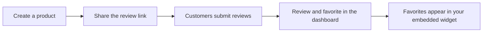

<div align="center">


**Collect testimonials with a shareable link and show the best ones on any website with one script tag.**

No hosting, no forms to build, no technical skills required.

[](https://github.com/munadil-dev/vouch/actions/workflows/ci.yml)
[](LICENSE)


[Live demo](https://vouch.munadil.com) · [Documentation](https://vouch.munadil.com/docs) · [Report a bug](https://github.com/munadil-dev/vouch/issues)

</div>

---

## Features

- **Shareable review form**: create a product and get a public link where customers leave a message, a 1–5 star rating and an optional photo.
- **Dashboard**: see every submission per product, favorite the best ones and delete spam.
- **Analytics**: daily views, responses and conversion over 7, 30 or 90 days, plus an all-time rating breakdown.
- **Embeddable widget**: paste two lines of HTML to show your favorited testimonials on any site. It's plain JavaScript with no framework and no iframe, served from a CDN cache.
- **Accessible by default**: a keyboard-operable star rating, inline form errors announced to screen readers, and widget cards with list semantics and text alternatives for ratings.
- **Validated end to end**: the same Zod schema checks input in the browser and on the server.
- **Secure**: Google sign-in via Auth.js, and every mutation is scoped to the owner of the product.
- **Built-in docs**: guides for users at `/docs`, powered by Fumadocs with full-text search.

## How it works



## Embed the widget

Copy the snippet from your product page in the dashboard and paste it where the reviews should appear:

```html
<div id="embed-reviews"></div>
<script src="https://vouch.munadil.com/api/embed-reviews?productId=YOUR_PRODUCT_ID"></script>
```

Only reviews you mark as a favorite are shown. The CDN caches responses for 2 minutes, then refreshes them in the background, so a newly favorited review can take a visit or two after that to appear.

## Tech stack

| Area       | Tools                                                                                                                         |
| ---------- | ----------------------------------------------------------------------------------------------------------------------------- |
| Framework  | [Next.js 16](https://nextjs.org/) (App Router), [React 19](https://react.dev/), [TypeScript](https://www.typescriptlang.org/) |
| Styling    | [Tailwind CSS 4](https://tailwindcss.com/), [shadcn/ui](https://ui.shadcn.com/), [Motion](https://motion.dev/)                |
| Docs       | [Fumadocs](https://fumadocs.dev/) (MDX)                                                                                       |
| Data       | [PostgreSQL](https://www.postgresql.org/), [Prisma 7](https://www.prisma.io/)                                                 |
| Auth       | [Auth.js](https://authjs.dev/) with Google                                                                                    |
| Validation | [Zod 4](https://zod.dev/)                                                                                                     |
| State      | [Jotai](https://jotai.org/)                                                                                                   |
| Uploads    | [Uploadcare](https://uploadcare.com/)                                                                                         |
| Testing    | [Vitest](https://vitest.dev/), [Testing Library](https://testing-library.com/)                                                |
| CI         | GitHub Actions (format check, tests, build)                                                                                   |

## Getting started

### Prerequisites

- [Node.js](https://nodejs.org/) 24+
- [pnpm](https://pnpm.io/)
- A PostgreSQL database (local, [Neon](https://neon.tech/), [Supabase](https://supabase.com/), etc.)
- A [Google OAuth client](https://console.cloud.google.com/apis/credentials) with the redirect URI `http://localhost:3000/api/auth/callback/google`

### Setup

1. **Clone the repository**

   ```bash
   git clone https://github.com/munadil-dev/vouch.git
   cd vouch
   ```

2. **Configure environment variables**

   ```bash
   cp .env.example .env.local
   ```

   | Variable                | Description                                                                    |
   | ----------------------- | ------------------------------------------------------------------------------ |
   | `AUTH_SECRET`           | Random secret for Auth.js. Generate one with `openssl rand -base64 32`.        |
   | `AUTH_GOOGLE_ID`        | Google OAuth client ID.                                                        |
   | `AUTH_GOOGLE_SECRET`    | Google OAuth client secret.                                                    |
   | `DATABASE_URL`          | Postgres connection string used by the app (a pooled URL works).               |
   | `DIRECT_URL`            | Direct (non-pooled) Postgres connection string, used by Prisma for migrations. |
   | `NEXT_PUBLIC_BASE_URL`  | Public URL of the app, with a trailing slash, e.g. `http://localhost:3000/`.   |
   | `UPLOADCARE_SECRET_KEY` | Uploadcare secret key, used to keep review photos once a review is saved.      |

3. **Install dependencies**

   ```bash
   pnpm install
   ```

   This also generates the Prisma client.

4. **Set up the database**

   ```bash
   pnpm migrate:dev
   ```

5. **Start the development server**

   ```bash
   pnpm dev
   ```

   Open [http://localhost:3000](http://localhost:3000).

## Scripts

| Command                | Description                                         |
| ---------------------- | --------------------------------------------------- |
| `pnpm dev`             | Start the development server                        |
| `pnpm build`           | Generate the Prisma client and build the app        |
| `pnpm start`           | Run the production build                            |
| `pnpm test`            | Run the test suite once                             |
| `pnpm test:watch`      | Run tests in watch mode                             |
| `pnpm format`          | Format the codebase with Prettier                   |
| `pnpm format:check`    | Check formatting (runs in CI)                       |
| `pnpm migrate:dev`     | Create and apply database migrations                |
| `pnpm db:push`         | Push the schema to the database without a migration |
| `pnpm prisma:generate` | Regenerate the Prisma client                        |
| `pnpm prisma:studio`   | Open Prisma Studio to browse the database           |

## Project structure

```
app/
  (auth)/auth/signin/       Sign-in page, without the site navbar
  (main)/                   App pages with the site navbar and footer
    (review)/[productId]/ Public review form
    dashboard/              Product and review management
  api/                      Route handlers (reviews, products, embed widget, docs search)
  docs/                     Documentation site (Fumadocs)
components/
  auth/ layout/ home/       Sign-in, navbar and footer, landing page
  product/ review/          Product and review features
  shared/                   Used by more than one feature
  ui/                       shadcn/ui
icons/                      Brand icons (Google, GitHub, X)
content/docs/               Documentation pages in MDX
lib/                        Auth, database client, docs source, utilities
prisma/                     Schema and migrations
schemas/                    Zod schemas shared by client and server
store/                      Jotai atoms
```

## Testing

Tests sit next to the code they cover (`*.test.ts` / `*.test.tsx`) and run with Vitest and Testing Library:

```bash
pnpm test
```

They cover the Zod schemas, the review form and star rating (including keyboard and screen reader behaviour), the review list filters, the API routes (ownership checks, status codes), the analytics helpers, storing Uploadcare photos and the embed widget, including XSS safety.

## Contributing

Contributions are welcome.

1. Fork the repository and create a branch from `main`.
2. Make your change and add tests where it makes sense.
3. Run `pnpm format`, `pnpm test` and `pnpm build`.
4. Open a pull request. CI must pass before merging.

For larger changes, please [open an issue](https://github.com/munadil-dev/vouch/issues) first to discuss the idea.

## License

[MIT](LICENSE) © Munadil
